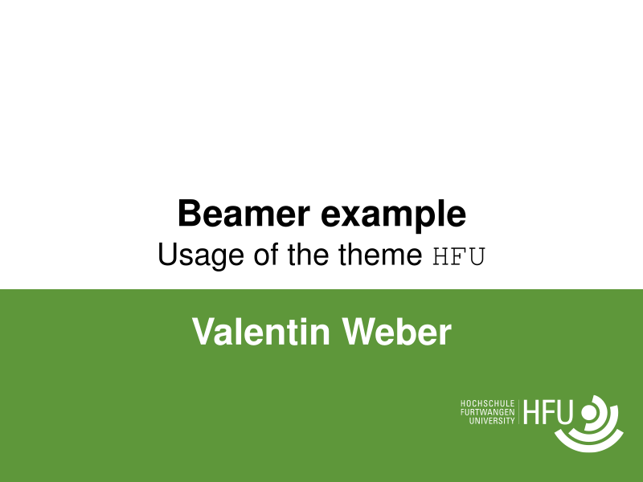

# HFU
Beamer theme for the Hochschule Furtwangen University.
This theme was forked from [UiB by Martin Helso](https://github.com/martinhelso/UiB).



## Logo
The logo can be removed from a specific `frame`
using the macro `\hidelogo` outside of the `frame` like this:
```LaTeX
\hidelogo
\begin{frame}
    ...
\end{frame}
```
Use `\showlogo` in the same manner to make the logo appear again. 

## Table of Contents
The table of contents is populated automatically using sections and subsections.
You can insert the table of contents again and highlight the current section like this: 
```LaTeX
\begin{frame}{Table of contents}
    \tableofcontents[currentsection]
\end{frame}
```

## Section page
The command `\SectionPage` inserts a plain frame with the centered section title on green background.
The command `\SectionPageAlt` inserts a regular frame with the centered section title.

If you want to replicate this page style but don't want to create a section for it, you can use \SectionPageWithText{<yourtext>} or \SectionPageAltWithText{<yourtext>} to override the centered title text.

## Enumerated references
The command `\enumref` inserts a reference to an enumerated item
in the shape of a green box,
like the ones used in the `enumerate` environment.

## Options
Options are given as
```LaTeX
\usetheme[option]{HFU}
```

### Font
By default,
almost all text is typeset in a sans serif.
The option `MathSerif` enables serifs for mathematical symbols,
whereas `Serif` enables serifs for all text.

### Logo
By default,
the logo appears in the lower right corner.
The option `logotop` moves the logo to the top right corner.

### Numbered environments
By default,
the environments listed below are unnumbered.
The option `numbered` adds numbers,
whereas `AMS` adds numbers and typesets the environment names
in the style of the American Mathematical Society.

### Title frame
Presentations automatically start with a title frame.
It can be disabled with the option `NoTitlePage`.

### Language
If one of the options
* `american`
* `english`
* `UKenglish`
* `USenglish`
* `german`

are given,
the environments listed below are translated into the specified language.

## Environments
An _environment_ is initialized with
```LaTeX
\begin{environment}
    ...
\end{environment}
```
The following environments are predefined by `beamer`:
* `corollary`
* `definition`
* `definitions`
* `example`
* `examples`
* `fact`
* `lemma`
* `theorem`

In addition, `HFU` defines these environments:
* `assumption`
* `axiom`
* `calculation`
* `computation`
* `conjecture`
* `facts`
* `hypothesis`
* `notation`
* `observation`
* `proposition`
* `property`
* `remark`
* `remarks`
